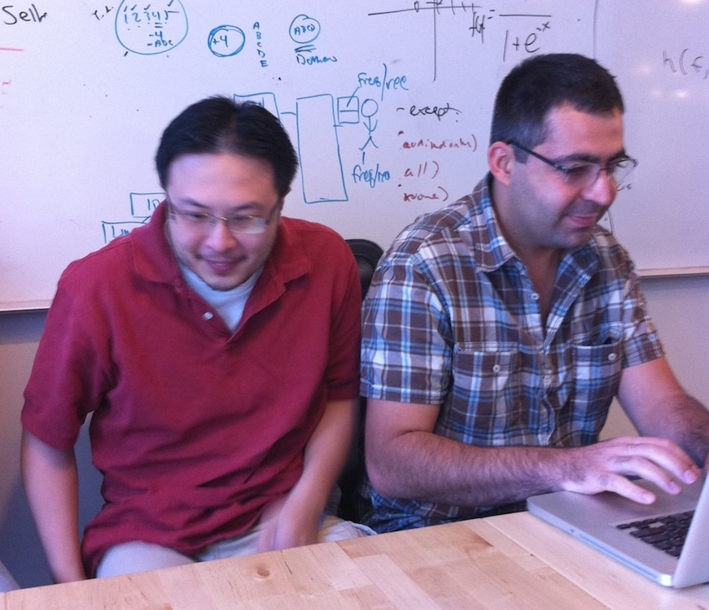

!SLIDE

# HACKATHON 2010 PRE-FUNK

!SLIDE

!SLIDE

### JSON REST API Calls

@@@ bash
$ curl -b c -c c 'http://hb.sand-08.adnxs.net/auth?username=user&password=pass'
{"response": {
	"status":"OK",
	"token":"or5o3137t03iluck36746rovf1",
	"dbg_info":{
		"instance":"01.hbapi.sand-08.lax1",
		"slave_hit":false,
		"db":"master",
		"time":414.46590423584
	}}}
@@@

!SLIDE

## The API is really easy to use. 

* GET - retrieve objects
* POST - save new objects
* PUT - update existing objects
* DELETE - delete objects

!SLIDE

## GET

@@@ bash
$ curl -b c -c c 'http://hb.sand-08.adnxs.net/advertiser?id=3'
{"response":{"status":"OK","advertiser":{"id":3,"code":"emilyadvt_1","name":"Official Advertiser","state":"active","default_brand_id":0,"remarketing_segment_id":null,"lifetime_budget":null,"lifetime_budget_imps":null,"daily_budget":null,"daily_budget_imps":null,"enable_pacing":true,"profile_id":null,"control_pct":0,"timezone":"EST5EDT","last_modified":"2010-09-15 18:01:24","stats":null,"billing_internal_user":{"id":"43","first_name":null,"last_name":null,"username":"emilyhb"},"billing_address1":"4323 Duck St","billing_address2":"Apt 2","billing_city":"Eugene","billing_state":"LA","billing_country":"US","billing_zip":"97405","default_category":null,"default_currency":"USD","labels":null,"use_insertion_orders":true,"time_format":"12-hour"},"count":1,"start_element":null,"num_elements":null,"dbg_info":{"instance":"01.hbapi.sand-08.lax1","slave_hit":false,"db":"master","time":239.90416526794}}}
@@@

!SLIDE

## POST

@@@ bash
$ curl -b c -c c -X POST -d '{"advertiser":{"name":"Hackathon Rockx"}}' \
'http://hb.sand-08.adnxs.net/advertiser'
{"response":{
	"status":"OK",
	"id":3344,
	"dbg_info":{
		"instance":"01.hbapi.sand-08.lax1",
		"slave_hit":false,
		"db":"master",
		"time":167.39797592163
}}}
@@@

!SLIDE

## PUT

@@@ bash
$ curl -b c -c c -X PUT -d '{"advertiser":{"name":"Hackathon Rocks"}}' \
'http://hb.sand-08.adnxs.net/advertiser?id=3344'
{"response":{
	"status":"OK",
	"id":"3344",
	"dbg_info":{
		"instance":"01.hbapi.sand-08.lax1",
		"slave_hit":false,
		"db":"master",
		"time":173.71296882629
}}}
@@@

!SLIDE

## DELETE

@@@ bash
$ curl -b c -c c -X DELETE 'http://hb.sand-08.adnxs.net/advertiser?id=3344'
{"response":{
	"status":"OK",
	"dbg_info":{
		"instance":"01.hbapi.sand-08.lax1",
		"slave_hit":false,
		"db":"master",
		"time":177.67715454102
}}}
@@@

!SLIDE

[The DisplayWords API Documentation Wiki](http://wiki.appnexus.com/display/dwapi/Home)

!SLIDE

@@@ php
<?php
// create api object
$dw = new DW('http://dw.sand-08.adnxs.net');
// authenticate
$auth = $dw->get('/auth?username=' . $username . '&password=' . $password);
// set token for later authenticated calls
$dw->setToken($auth['response']['token']);
// get an advertiser
$resp = $dw->get('/advertiser?id=292');
$advertiser = $resp['response'];
// change the name
$advertiser['advertiser']['name'] = 'Hackthons Rockx';
// save the advertiser
$dw->put('/advertiser?id=292', $advertiser);
// ummm... delete the advertiser
$dw->delete('/advertiser?id=292');
@@@

!SLIDE

[Example in action](http://webdev.adnxs.net/~tjohnson/Hack-Day-2010/php-example/example.php)  
[Find the code here](https://github.com/adnexus/Hack-Day-2010)

!SLIDE

# Conventions

!SLIDE

## Objects: {}

!SLIDE

## Arrays: []

!SLIDE

## Arrays of Objects: [{...}, {...}, {...}]

!SLIDE

## Null: null
## not: "null"
## or: ""  

!SLIDE

# GET Structure

{ "response": {
	"status": "OK",
	"advertisers": [
		{...}
	]
}}

### or

{ "response": {
	"status": "OK",
	"advertiser": 
		{...}
}}

!SLIDE

# POST & PUT Structure

{ "advertiser": {
	"id": 182,
	"name": "Name",
	...
}}

[#](http://webdev.adnxs.net/~tjohnson/Hack-Day-2010/php-example/example.php?endpoint=/advertiser?id=3)

!SLIDE

# Let's try this all out

* ssh you@jump.adnxs.net
* ssh 01.general.dev.nym1
* cd public_html
* cp /tmp/hack-day-2010.tar.gz .
* tar -zxvf hack-day-2010.tar.gz
* cd Hack-Day-2010
* [http://webdev.adnxs.net/~YOU/Hack-Day-2010/php-example/example.php](http://webdev.adnxs.net/~tjohnson/Hack-Day-2010/php-example/example.php)

!SLIDE 

# Questions?

